# Kubelens

<div align="center">


**Multi-Cluster Kubernetes Dashboard**

[](https://github.com/kubelensai/kubelens/actions/workflows/release.yml)
[](https://hub.docker.com/r/kubelensai/kubelens-app)
[](LICENSE)

[Live Demo](https://kubelens.app) • [Documentation](#documentation) • [Installation](#quick-start)

</div>

---

## 📸 Intro

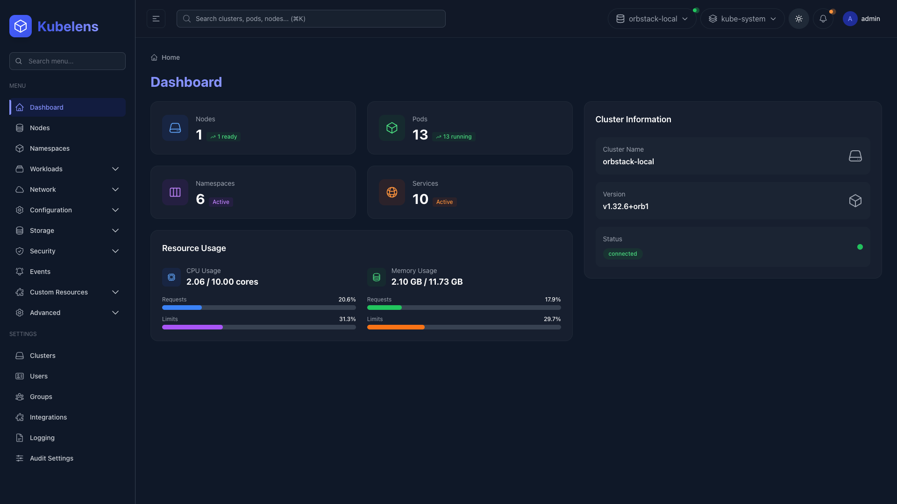

<div align="center">

**Full-featured mobile interface with responsive design**

<table>
<tr>
<td align="center" width="33%">
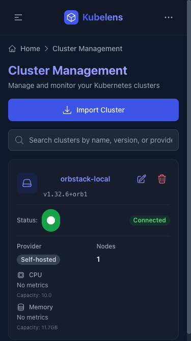
<br />
<strong>Clusters</strong>
</td>
<td align="center" width="33%">
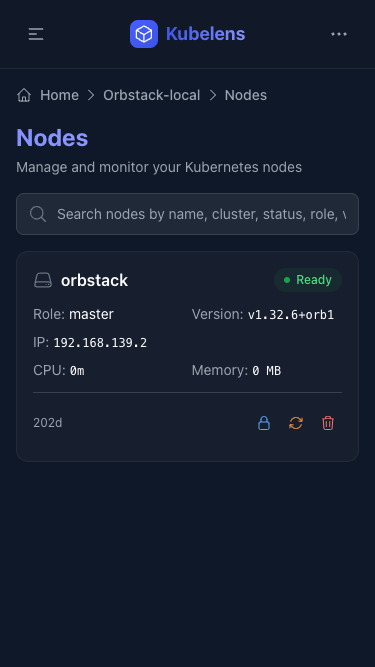
<br />
<strong>Nodes</strong>
</td>
<td align="center" width="33%">
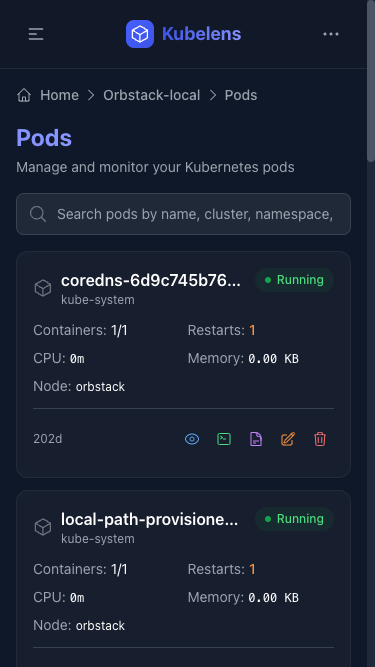
<br />
<strong>Pods</strong>
</td>
</tr>
</table>

*Manage your Kubernetes clusters on the go with native mobile support*

</div>
---

## ✨ Core Features

- 🌐 **Multi-Cluster Management** - Manage multiple Kubernetes clusters from one interface
- 🔐 **Enterprise Security** - JWT authentication, MFA/TOTP, RBAC, OAuth2 (Google)
- 📊 **Real-time Monitoring** - Live metrics, resource usage, and health status
- 🚀 **Complete Workload Management** - Manage Pods, Deployments, StatefulSets, DaemonSets, Jobs, and CronJobs with shell access and YAML editing
- 🔧 **Resource Management** - Services, Ingresses, ConfigMaps, Secrets, PersistentVolumes, and StorageClasses
- 🎯 **Custom Resources** - Full CRD support with custom resource management
- 👥 **User Management** - Users, groups, roles, and permissions with RBAC
- 📝 **Audit Logging** - Comprehensive audit trails with configurable retention policies
- 📱 **Responsive UI** - Modern React interface with mobile support
- 🎨 **Theme Support** - Beautiful light and dark modes with seamless switching

---

## 📸 More Screenshots

### Light & Dark Mode Comparison

| Light Mode | Dark Mode |
|:----------:|:---------:|
| 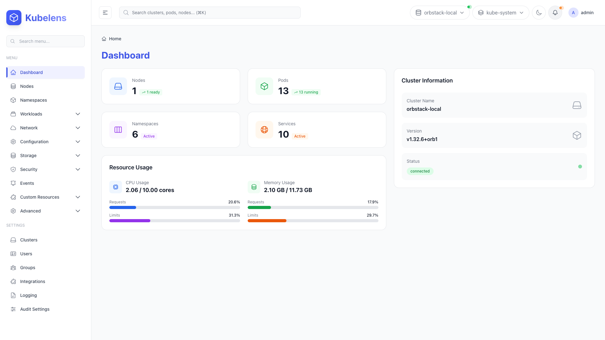 |  |

### Authentication

| Login Page | MFA Verification |
|:----------:|:----------------:|
| 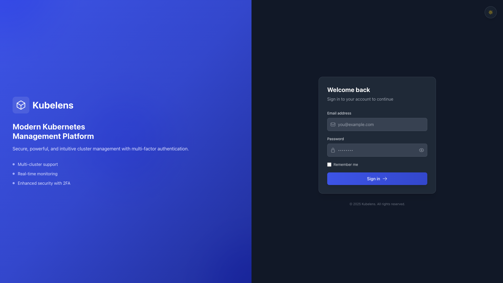 |  |

### Resource Management

| Clusters | Nodes | Pods |
|:--------:|:-----:|:----:|
| 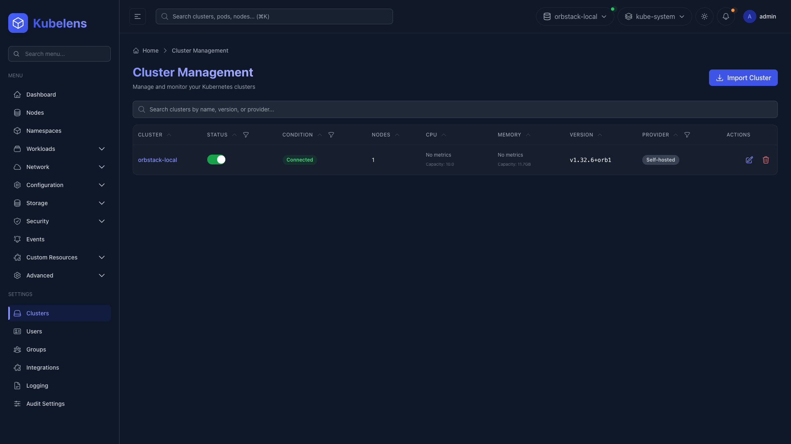 | 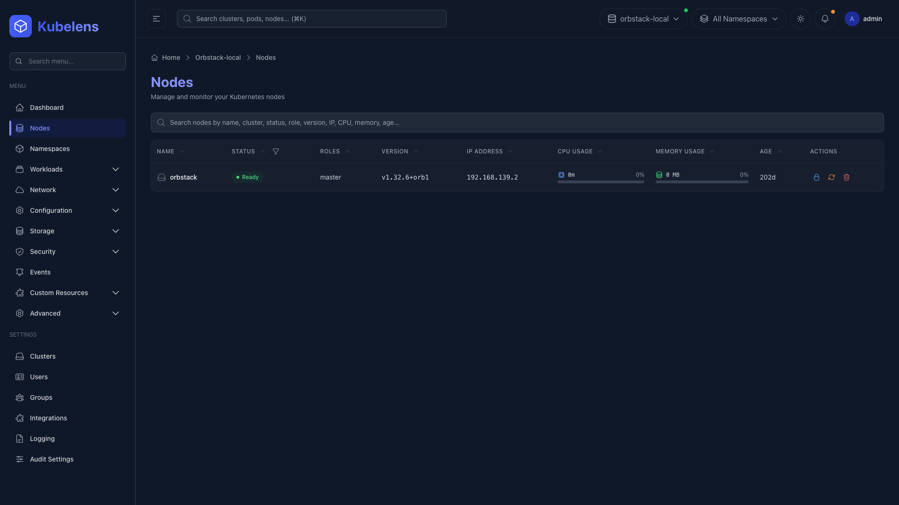 | 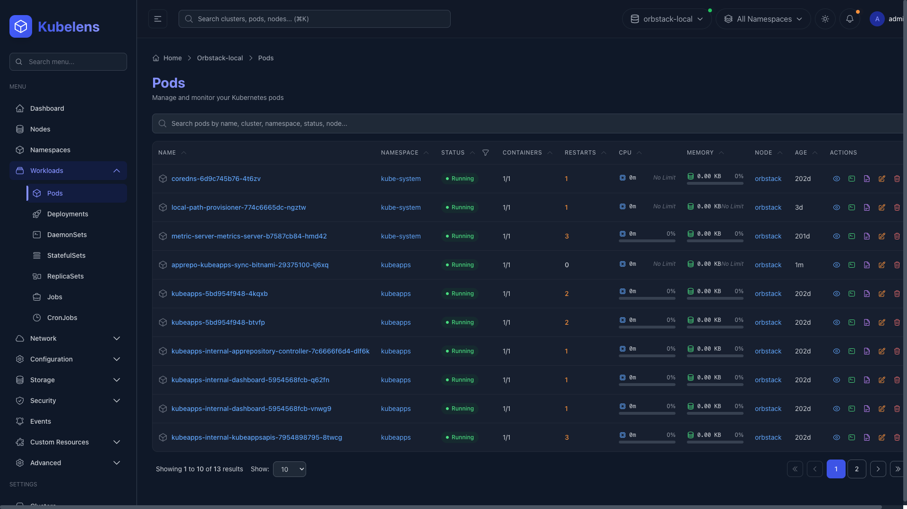 |

| Deployments | Services | ConfigMaps |
|:-----------:|:--------:|:----------:|
| 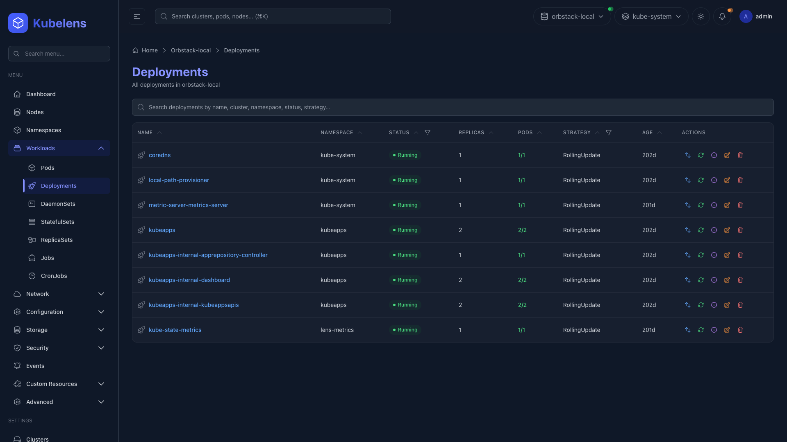 | 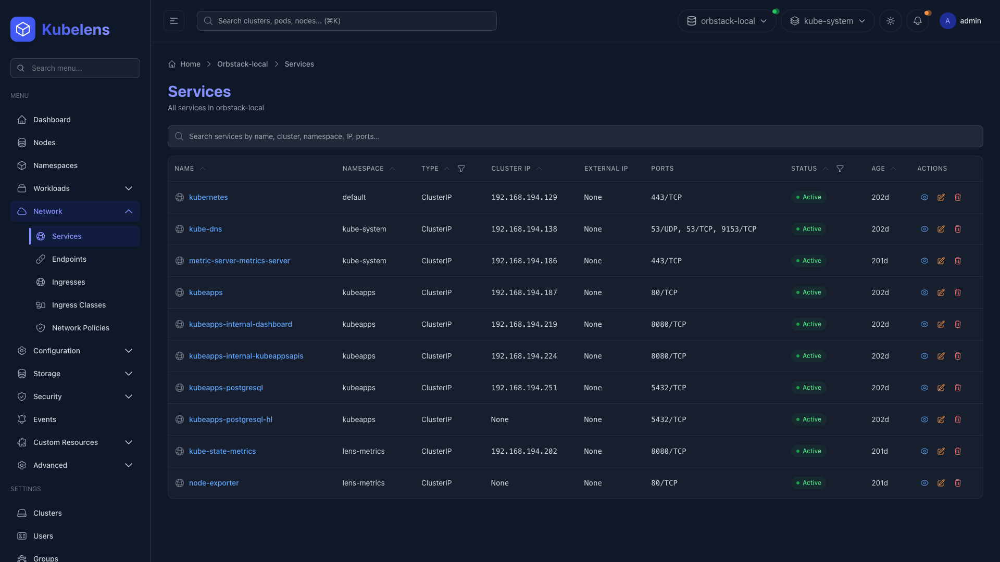 | 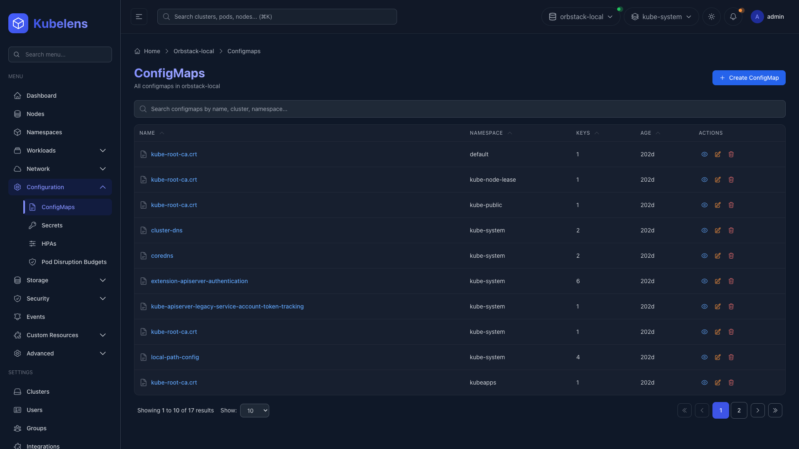 |

### Security & Settings

| Users | Groups | Integrations |
|:-----:|:------:|:------------:|
| 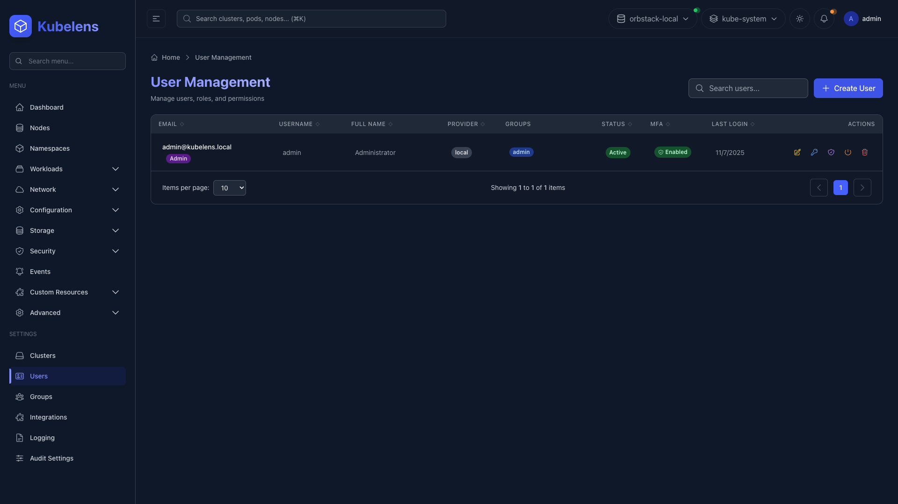 | 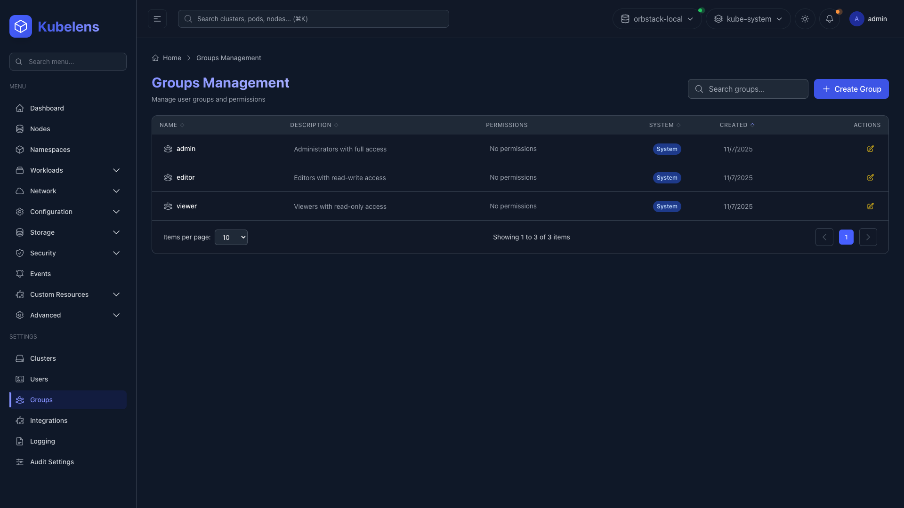 | 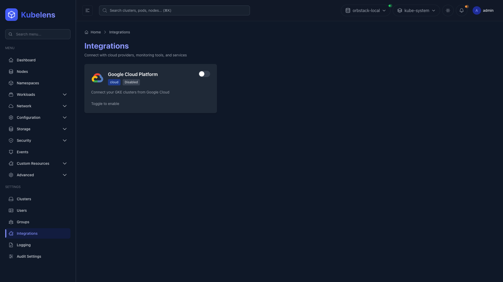 |

| Logging | Audit Settings | Secrets |
|:-------:|:--------------:|:-------:|
| 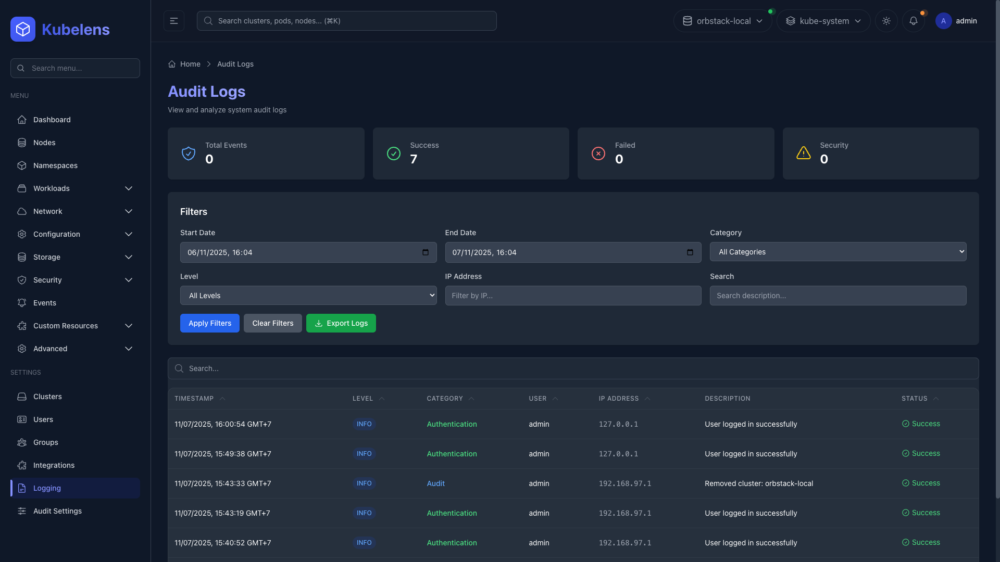 | 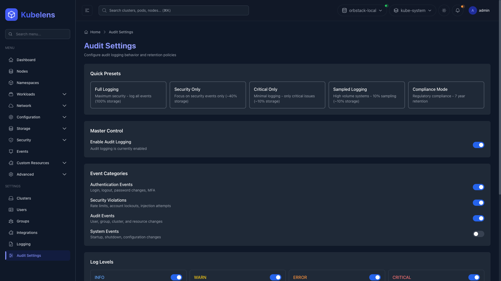 | 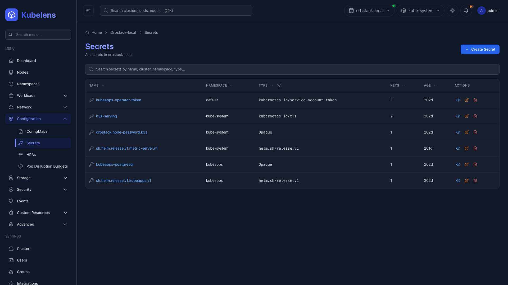 |


---

## 🚀 Quick Start

### Docker Compose (Recommended)

**SQLite (Development)**
```bash
docker-compose -f docker-compose.sqlite.yml up -d
```

**PostgreSQL (Production)**
```bash
docker-compose -f docker-compose.yml up -d
```

Access at `http://localhost:3000`

**Default Credentials:**
- Email: `admin@kubelens.local`
- Password: `admin123`

### Helm (Production)

```bash
# Add repository
helm repo add kubelens https://kubelensai.github.io/kubelens/
helm repo update

# Install
helm install kubelens kubelens/kubelens \
  --namespace kubelens \
  --create-namespace \
  --set ingress.enabled=true \
  --set ingress.host=kubelens.yourdomain.com
```

### Docker Images

```bash
# Docker Hub
docker pull kubelensai/kubelens-app:latest
docker pull kubelensai/kubelens-server:latest
docker pull kubelensai/kubelens-shell:latest

# GitHub Container Registry
docker pull ghcr.io/kubelensai/kubelens-app:latest
docker pull ghcr.io/kubelensai/kubelens-server:latest
docker pull ghcr.io/kubelensai/kubelens-shell:latest
```

---

## ⚙️ Advanced Configuration

### Database Options

#### SQLite (Default - Development)

```yaml
# docker-compose.sqlite.yml
DB_TYPE=sqlite
DB_PATH=/data/kubelens.db
```

#### PostgreSQL (Production)

```yaml
# docker-compose.yml
DB_TYPE=postgres
DB_HOST=postgres
DB_PORT=5432
DB_NAME=kubelens
DB_USER=kubelens
DB_PASSWORD=your-secure-password
```

#### MySQL

```yaml
DB_TYPE=mysql
DB_HOST=mysql
DB_PORT=3306
DB_NAME=kubelens
DB_USER=kubelens
DB_PASSWORD=your-secure-password
```

### Environment Variables

**Backend (Go)**
```bash
# Server
PORT=8080
LOG_LEVEL=info
RELEASE_MODE=false

# Authentication
JWT_SECRET=your-secret-key-here
JWT_EXPIRATION=24h
DEFAULT_ADMIN_PASSWORD=admin123

# Database (SQLite)
DB_TYPE=sqlite
DB_PATH=/data/kubelens.db

# Database (PostgreSQL)
DB_TYPE=postgres
DB_HOST=localhost
DB_PORT=5432
DB_NAME=kubelens
DB_USER=kubelens
DB_PASSWORD=secret

# Database (MySQL)
DB_TYPE=mysql
DB_HOST=localhost
DB_PORT=3306
DB_NAME=kubelens
DB_USER=kubelens
DB_PASSWORD=secret

# Rate Limiting
GLOBAL_RATE_LIMIT_PER_MIN=1000
LOGIN_RATE_LIMIT_PER_MIN=10

# CORS
CORS_ORIGINS=http://localhost:3000,https://kubelens.app
```

**Frontend (React)**
```bash
VITE_API_URL=http://localhost:8080
VITE_WS_URL=ws://localhost:8080
```

---

## 🏗️ Tech Stack

**Frontend**
- React 18 + TypeScript
- Vite (Build tool)
- Tailwind CSS
- Zustand (State management)
- React Router v6

**Backend**
- Go 1.23+
- Gin Web Framework
- GORM (ORM)
- JWT + TOTP/MFA
- Kubernetes Client-Go

**Database**
- SQLite (Development)
- PostgreSQL (Production)
- MySQL (Alternative)

---

## 🛠️ Development

### Local Setup

**Prerequisites**
- Go 1.23+
- Node.js 18+
- Docker 20+

**Backend**
```bash
cd src/server
go run cmd/server/main.go
```

**Frontend**
```bash
cd src/app
npm install
npm run dev
```

### Testing

**Frontend**
```bash
cd src/app
npm test -- --run
```

**Backend**
```bash
cd src/server
go test -v -race -coverprofile=coverage.out ./internal/...
```

---

## 📦 Installation Options

| Method | Registry | Command |
|--------|----------|---------|
| **Helm Repo** | GitHub Pages | `helm repo add kubelens https://kubelensai.github.io/kubelens/` |
| **OCI (GHCR)** | GitHub Container Registry | `helm install kubelens oci://ghcr.io/kubelensai/helm-charts/kubelens` |
| **OCI (Docker Hub)** | Docker Hub | `helm install kubelens oci://registry-1.docker.io/kubelensai/kubelens` |
| **Local** | Git Clone | `git clone https://github.com/kubelensai/kubelens.git` |

See [charts/INSTALL.md](charts/INSTALL.md) for detailed instructions.

---

## 📚 Documentation

- [Installation Guide](charts/INSTALL.md)
- [API Reference](docs/api.md)
- [Contributing Guide](CONTRIBUTING.md)

---

## 🔗 Links

- **Live Demo**: [kubelens.app](https://kubelens.app)
- **GitHub**: [github.com/kubelensai/kubelens](https://github.com/kubelensai/kubelens)
- **Docker Hub**: [hub.docker.com/u/kubelensai](https://hub.docker.com/u/kubelensai)
- **GHCR**: [ghcr.io/kubelensai](https://github.com/orgs/kubelensai/packages)
- **Helm Charts**: [kubelensai.github.io/kubelens](https://kubelensai.github.io/kubelens/)

---

## 📄 License

MIT License - see [LICENSE](LICENSE) for details.

---

## 💬 Support

- **Issues**: [GitHub Issues](https://github.com/kubelensai/kubelens/issues)
- **Discussions**: [GitHub Discussions](https://github.com/kubelensai/kubelens/discussions)

---

<div align="center">

Made with ❤️ by the Kubelens Team

</div>
